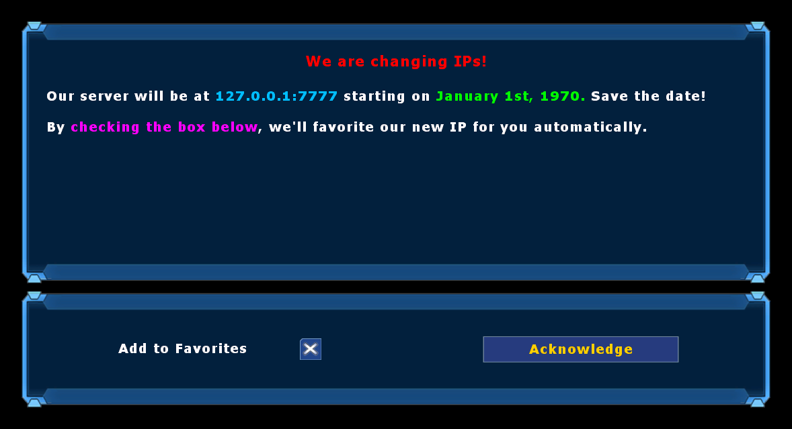

NewIPInfo
===========
NewIPInfo is a simple mutator for Unreal Tournament 2004 with the goal of informing players that your server is changing IP addresses.
This mutator will prompt players who join your server with a menu before spawning which informs them using a customizeable message.
Additionally, if the player joining has favorited your server already, then this mod will also favorite your server with the new IP address for them automatically.

This mutator is fully compatible with DruidsPlayerAgreement. When both mods are in use, the NewIPInfo menu will display first and then the player agreement menu will display after the New IP menu is dismissed.

Installation
------------
Download the [latest release](https://github.com/0xC0ncord/NewIPInfo/releases/latest) and install it to your server's `System/` directory. Then, to activate the mod, do one of the following:
1. Add the server actor to your `ServerActors`:
```
ServerActors=NewIPInfo101.NewIPInfoServerActor
```
OR

2. Add the mutator to your server's commandline (placement order does not matter):
```
Mutator=NewIPInfo101.MutNewIPInfo,...
```
You must also ensure that this package exists on your server's redirect, regardless of whether you add it as a Server Actor or as a Mutator.
No matter which method you choose, your server will have the `MutNewIPInfo` mutator running which is needed to react to joining players and prompt them with the menu.
Adding the file to your `ServerPackages` is optional as the mutator will do this automatically.

Configuration
-------------
On the server, some additional options may be configured in the `NewIPInfo.ini` file:
```ini
[Main NewIPInfoServerConfig]
HeaderText="$(255,0,0)We are changing IPs!"
ContentText="$(255,255,255)Our server will be at $(0,192,255)$1$(255,255,255) starting on $(0,255,0)January 1st, 1970. $(255,255,255)Save the date!"
AlreadyFavoriteText="$(255,0,255)Since you have already favorited us, we will favorite our new IP for you automatically."
NewIPAddress="127.0.0.1:7777"
NewFavoriteName="$(255,0,0)(NEW IP: Jan 1 1970) $(255,255,255)Clan Awesome's Server"
bUseSpawnProtection=True
IdleTimeoutSeconds=120
```
For the below string properties, color codes in the format `$(R,G,B)` are supported when specified.
- `HeaderText` - the text to display at the top of the window in the text box. This string supports color codes.
- `ContentText` - the main text to display in the text box. Multiple lines are supported with the `|` character as well as color codes. Finally, the substring `$1` will be automatically replaced with the content specified in `NewIPAddress` if it's present.
- `AlreadyFavoriteText` - this text will be appended to the text box if the player has already favorited your server as a courtesy to let them know you've modified their favorites on their behalf (which is usually a rude thing to do). This string supports multiple lines with the `|` character as well as color codes.
- `NewIPAddress` - the `ADDRESS:PORT` combo for your server's new IP address.
- `NewFavoriteName` - if this mod adds your server's new IP to a player's favorites, this is the name it will show up in the server browser as. Note that as soon as your server goes online on that IP, this name will be overwritten with the actual name of the server when the client goes to ping it. This string supports color codes.
- `bUseSpawnProtection` - whether joining players should have spawn protection while the NewIPInfo menu is open. If disabled, players will be made into spectators instead and will auto-join when the menu is closed.
- `IdleTimeoutSeconds` - number of seconds that players with the menu open will have additional time on top of the server's default idle kicker. This is to ensure that players busy reading the text don't get kicked too early for idling.

Screenshots
-----------


License
-------
NewIPInfo is licensed under the Open Unreal Mod License version 1.1. See [LICENSE](LICENSE) for details.

Credits
-------
Much of this mod's code is borrowed from [OpenSpyInfo](https://github.com/0xC0ncord/OpenSpyInfo), so much credit is attributed there as appropriate.
- `Ema` for their gracious commissioning of this mod.
- Me, `0xC0ncord` aka `TonyTheSlayer` for the creation of this mod.
